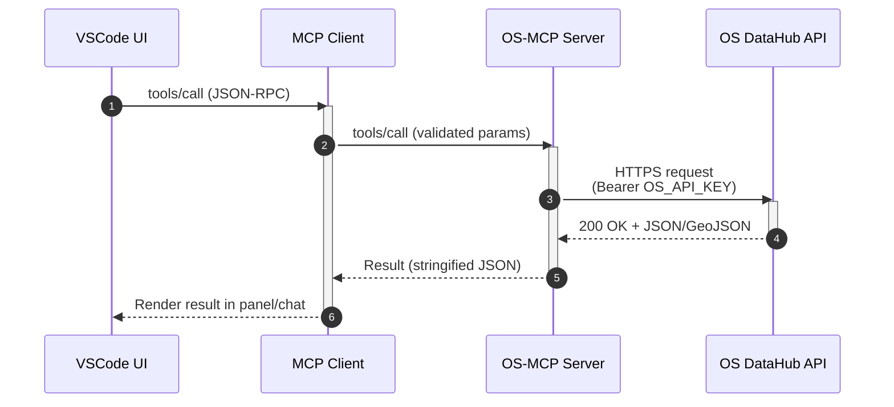
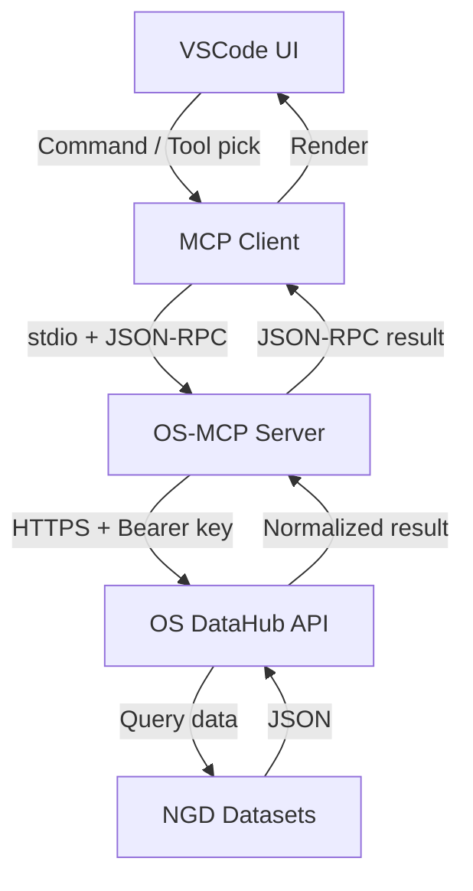

# Diagrams

### 1) Sequence (request/response path)

```mermaid
sequenceDiagram
autonumber
participant UI as VSCode UI
participant MC as MCP Client
participant S as OS‑MCP Server
participant API as OS DataHub API

UI->>MC: tools/call (JSON‑RPC)
activate MC
MC->>S: tools/call (validated params)
activate S
S->>API: HTTPS request<br/>(Bearer OS_API_KEY)
activate API
API-->>S: 200 OK + JSON/GeoJSON
deactivate API
S-->>MC: Result (stringified JSON)
deactivate S
MC-->>UI: Render result in panel/chat
deactivate MC
```

### 2) Component/flow (who talks to whom)

```mermaid
flowchart TD
  UI[VSCode UI] -->|Command / Tool pick| MC[MCP Client]
  MC -->|stdio + JSON‑RPC| SRV[OS‑MCP Server]
  SRV -->|HTTPS + Bearer key| HUB[OS DataHub API]
  HUB -->|Query data| NGD[NGD Datasets]
  NGD -->|JSON| HUB
  HUB -->|Normalized result| SRV
  SRV -->|JSON‑RPC result| MC
  MC -->|Render| UI
```
